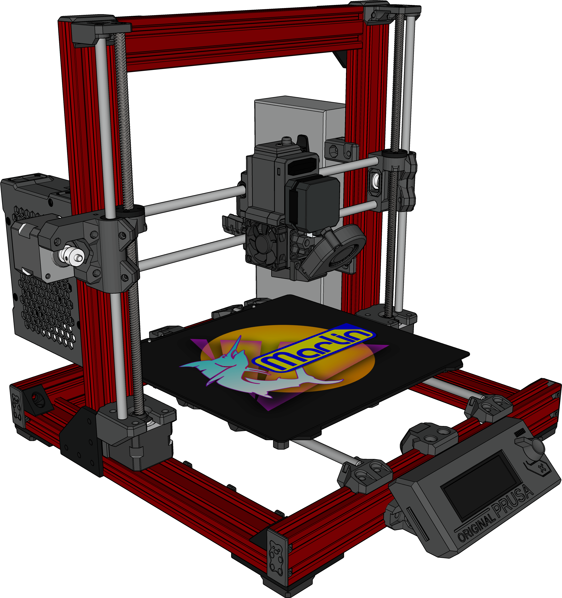

<h1 align="center">Prusa MK3S Marlin Firmware BTT002 V1 / Multi-TMC / BMG</h1>

    
    
    
    
    
     
    

## Specs

This firmware is configured for a heavily modified Prusa MK3S Bear 2.1 with the following upgrades:

### Frame
* [Red Bear 2.1](https://www.printedsolid.com/products/ldo-full-bear-2-1-upgrade-kit-for-mk2s-mk2-5s-mk3s?variant=39293677862997) & parts printed in [Priline Carbon Fiber Polycarbonate](https://www.amazon.com/dp/B074DS3986/) filament

### Motherboard
* [BigTreeTech BTT002 V1](https://github.com/bigtreetech/BTT002-V1.0) housed in Juan Puchol's [Universal BTT002 Box](https://www.thingiverse.com/thing:4231370)

### Drivers
* [BigTreeTech TMC2209s](https://www.biqu.equipment/products/bigtreetech-tmc2209-stepper-motor-driver-for-3d-printer-board-vs-tmc2208) or [TMC5160s](https://www.biqu.equipment/products/bigtreetech-tmc5160-v1-0-driver-spi-mode-silent-high-precision-stepstick-stepper-motor-driver-with-heatsink-for-skr-v1-3-gen-v1-4-reprap) on X/Y/Z/E

### Hotend
 * [Bondtech Upgrade Kit for Prusa i3 MK3S/+ Mosquito Fit](https://www.bondtech.se/product/prusa-i3-mk3s-mosquito-extruder-upgrade/)
 * [LDO 0.9° Slim Power pancake motor](https://www.printedsolid.com/products/ldo-nema-17-motor-pancake-ldo-42sth25-1404)
 * [Slice Engineering Mosquito Magnum Hotend](https://www.sliceengineering.com/products/mosquito-magnum-hotend)
 * [Slice Engineering 50W Heater Cartridge](https://www.sliceengineering.com/products/50w-heater-cartridge)
 * [Slice Engineering 0.4mm Vanadium nozzle](https://www.sliceengineering.com/products/vanadium-nozzle)
 * [SuperPINDA](https://www.prusa3d.com/product/superpinda/) ([Pepperl+Fuchs NBN2,5-8GM35-E1L-Y](https://www.pepperl-fuchs.com/global/en/classid_143.htm?view=productdetails&prodid=106674))

### Build Plates
  * [ULTISTIK Premium Powder Coated Ultem (PEI) Build Plate](https://www.filamentone.com/collections/ultistik-flexplate/products/ultistik-premium-powder-coated-ultem-pei-build-plate-254-x-241-prusa-mk3-mk3s)
  * [Phenolic LE (generic Garolite) Original Prusa MK52 Print Surface](https://www.etsy.com/listing/669225246/phenolic-le-generic-garolite-original)
  * [Thekkiinngg textured PEI spring steel sheet](https://www.amazon.com/dp/B07V1JYJS2/)
  * [Prusa Spring Steel Sheet With Smooth Double-sided PEI](https://www.prusa3d.com/product/spring-steel-sheet-with-smooth-double-sided-pei/)
  * [Prusa Textured PEI Powder-coated Spring Steel Sheet](https://www.prusa3d.com/product/double-sided-textured-pei-powder-coated-spring-steel-sheet/)
  * [Prusa Powder-coated PEI Satin Spring Steel Sheet](https://www.prusa3d.com/product/double-sided-powder-coated-pei-satin-spring-steel-sheet/)

### LCD
* [LDO Prusa Black Screen with White Text](https://www.printedsolid.com/products/ldo-prusa-black-screen-with-white-text-mk2-mk2-5-mk3-lcd-display)

### Other
* [Raspberry Pi 3 Model B+](https://www.raspberrypi.com/products/raspberry-pi-3-model-b-plus/) running [OctoPrint](https://octoprint.org/)

### Credits

First layer calibration based on [Prusa's MK3/S/+ "meander" first layer calibration](https://github.com/prusa3d/Prusa-Firmware/blob/MK3/Firmware/first_lay_cal.cpp)
